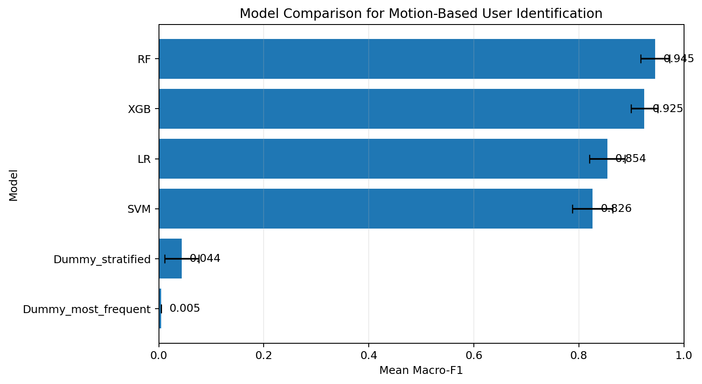

# Reproducible Motion-Based User Identification

A research-software proof of concept for identifying users from mobile motion-sensor sessions using PySpark, Python and machine learning.

The project transforms heterogeneous event-level sensor streams into session-level representations, compares several classification approaches under repeated validation, and produces closed-set user-identification predictions.

Beyond the machine-learning task, the repository demonstrates how an exploratory research workflow can be turned into modular, configurable, tested and reproducible research software.

---

## Research Question

Can a user be identified from the behavioral motion signature captured during a mobile sensor session?

The problem is formulated as multiclass closed-set classification:

- each training session belongs to one known user;
- sensor events are aggregated into a session representation;
- the model predicts the most likely user for an unseen session.

This is a research proof of concept rather than a production authentication system.

---

## Data

The raw data consist of event-level measurements from several mobile sensor types.

Each event contains:

- `timestamp`
- `sensor_type`
- `field_0 ... field_7`
- `session_id`
- `user_id` for training data

Different sensor types populate different fields, so missing values in some sensor-specific fields are expected.

### Dataset used in the experiment

| Property | Value |
|---|---:|
| Training events | 2,318,350 |
| Test events | 819,580 |
| Training sessions | 300 |
| Test sessions | 96 |
| Training sessions per user | 15 |
| Session-level imbalance ratio | 1.0 |
| Final ML features | 342 |

The source datasets are not redistributed in this repository.

The automated test suite instead uses small synthetic datasets, allowing the software components to be tested independently of the original research data.

---

## Workflow

```text
Raw sensor events
       │
       ▼
Data loading
       │
       ▼
Data validation
       │
       ▼
Session-level feature engineering
       │
       ▼
Train/test feature alignment
       │
       ▼
Repeated model comparison
       │
       ├── Dummy baselines
       ├── Logistic Regression
       ├── Linear SVM
       ├── Random Forest
       └── XGBoost
       │
       ▼
Paired statistical comparison
       │
       ▼
Random Forest tuning
       │
       ▼
Final model
       │
       ▼
User predictions
```

---

## Data Validation

Before modelling, the pipeline checks:

- missing values;
- sessions associated with more than one user;
- session-size distribution;
- available sensor types;
- number of sessions per user;
- class imbalance.

For the experiment used here:

```text
Mixed-user sessions: 0
Class imbalance ratio: 1.0
```

Every training user has 15 sessions.

---

## Session-Level Feature Engineering

The original data contain millions of sensor events.

The ML models operate at the session level, so the PySpark pipeline converts the raw event stream into one row per `session_id`.

For each `(session_id, sensor_type)` combination, the following are calculated:

- number of events;
- duration;
- event rate;
- mean;
- median;
- standard deviation;
- minimum;
- maximum;
- non-null observation count.

For the first three sensor fields, an additional magnitude feature is calculated:

```text
mag_012 = sqrt(
    field_0² +
    field_1² +
    field_2²
)
```

Magnitude statistics are then calculated in the same way.

Finally, sensor types are pivoted into wide columns.

The resulting training matrix contains:

```text
300 sessions × 342 ML features
```

while the test matrix contains:

```text
96 sessions × 342 ML features
```

---

## Model Evaluation

The main evaluation metric is **Macro-F1**, giving each user class equal weight.

Models are evaluated using 20 repeated stratified 80/20 train-validation splits.

Every model receives the same split for a given random seed so performance comparisons are paired.

### Results

| Model | Mean Macro-F1 | Std |
|---|---:|---:|
| Random Forest | **0.9454** | 0.0272 |
| XGBoost | 0.9246 | 0.0256 |
| Logistic Regression | 0.8543 | 0.0337 |
| Linear SVM | 0.8260 | 0.0382 |
| Dummy — stratified | 0.0435 | 0.0324 |
| Dummy — most frequent | 0.0048 | ~0 |



The real models substantially outperform the dummy baselines.

---

## RF vs XGBoost

Because Random Forest and XGBoost were the two strongest models, their scores were compared using a paired Wilcoxon signed-rank test across the same validation splits.

```text
Random Forest mean Macro-F1: 0.9454
XGBoost mean Macro-F1:       0.9246

Mean difference:             0.0208
Wilcoxon p-value:            0.0107
```

At the 0.05 significance level, the observed paired performance difference is statistically significant for these repeated splits.

This result should be interpreted within this experimental evaluation rather than as evidence that Random Forest is generally superior to XGBoost.

---

## Final Model

The selected Random Forest configuration was:

```text
n_estimators:       500
max_depth:          None
max_features:       sqrt
min_samples_leaf:   1
```

The final model is trained using all 300 labelled sessions and generates predictions for the 96 test sessions.

The resulting predictions are stored in:

```text
submission.csv
```

---

## Research Software Design

The initial analysis was implemented as a single end-to-end workflow.

The repository was subsequently refactored into reusable components:

```text
src/
│
├── data/
│   ├── loading.py
│   └── validation.py
│
├── features/
│   └── session_features.py
│
├── models/
│   ├── training.py
│   └── evaluation.py
│
├── visualization/
│   └── plots.py
│
└── cli.py
```

This separates:

- data access;
- validation;
- feature engineering;
- model training;
- statistical evaluation;
- visualization;
- orchestration.

The scientific methodology remains unchanged while the implementation becomes easier to test, reuse and extend.

---

## Configuration

Experiment settings are stored outside the implementation code in:

```text
configs/baseline.yaml
```

For example:

```yaml
project:
  name: "Motion-Based User Identification"

data:
  train_path: "/Volumes/workspace/threatfabric/project/train.csv"
  test_path: "/Volumes/workspace/threatfabric/project/test.csv"

evaluation:
  n_seeds: 20

model:
  final_model: "random_forest"
  random_state: 42

output:
  submission_path: "submission.csv"
  model_comparison_path: "images/model_comparison.png"
```

Researchers can therefore change environment-specific settings without modifying the pipeline implementation.

---

## Running in Databricks

### 1. Clone or import the repository

Open the repository in a Databricks Git folder/workspace.

### 2. Make the input data available

Place:

```text
train.csv
test.csv
```

in an accessible Databricks Volume.

### 3. Update the paths

Edit:

```text
configs/baseline.yaml
```

rather than modifying the Python source code.

### 4. Install dependencies

In the first Databricks notebook cell:

```python
%pip install -r requirements.txt
```

### 5. Run the experiment

The notebook entry point loads the configuration and executes the complete pipeline:

```python
from src.cli import (
    load_config,
    run_experiment,
)

config = load_config(
    "configs/baseline.yaml"
)

results = run_experiment(
    config,
    spark=spark,
)
```

The workflow performs data loading, validation, feature engineering, model comparison, statistical evaluation, Random Forest tuning, final training and test prediction.

---

## Command-Line Entry Point

The pipeline can also be invoked through:

```bash
python src/cli.py \
    --config configs/baseline.yaml
```

The configured data paths must be accessible to the Spark environment from which the command is executed.

---

## Automated Testing

The project includes lightweight automated tests covering the most important pipeline behavior:

```text
tests/
├── test_validation.py
├── test_features.py
└── test_models.py
```

The test suite verifies:

### Data validation

- null counting;
- detection of sessions assigned to multiple users;
- class-imbalance calculation.

### Feature engineering

- transformation from event-level data to session-level data;
- correct aggregation behavior;
- train/test feature alignment.

### Modelling

- final Random Forest fit and prediction;
- model-evaluation summary calculations.

The tests use small deterministic synthetic datasets and therefore do not require access to the original research dataset.

Run:

```bash
python -m pytest
```

Current test status:

```text
7 passed
```

---

## Continuous Integration

GitHub Actions runs the automated test suite on:

- pushes to `main`;
- pull requests targeting `main`.

The CI environment installs Python, Java, PySpark and the project dependencies before executing the tests.

This means changes to data validation, feature engineering or modelling can be automatically checked before they are incorporated into the research workflow.

---

## Repository Structure

```text
.
├── .github/
│   └── workflows/
│       └── tests.yml
│
├── configs/
│   └── baseline.yaml
│
├── src/
│   ├── data/
│   │   ├── loading.py
│   │   └── validation.py
│   ├── features/
│   │   └── session_features.py
│   ├── models/
│   │   ├── training.py
│   │   └── evaluation.py
│   ├── visualization/
│   │   └── plots.py
│   └── cli.py
│
├── tests/
│   ├── conftest.py
│   ├── test_validation.py
│   ├── test_features.py
│   └── test_models.py
│
├── images/
│   └── model_comparison.png
│
├── main.py
├── requirements.txt
├── pyproject.toml
├── REPORT.md
└── submission.csv
```

---

## Reproducibility

The project uses several mechanisms to improve reproducibility:

- explicit input schemas;
- configuration stored in YAML;
- deterministic random seeds;
- shared train-validation splits between competing models;
- modular feature-engineering code;
- automated tests using deterministic synthetic data;
- dependency specification;
- automated CI;
- generated result visualization;
- documented execution procedure.

The original research data are not included, so reproducing the exact numerical model results requires access to data with the same schema.

The software tests themselves are independent of those data.

---

## Limitations

This is a proof-of-concept research workflow.

Important limitations include:

- only 300 labelled sessions are available;
- evaluation uses repeated stratified holdout rather than an external validation cohort;
- session-level engineered statistics simplify the original temporal signals;
- the experiment performs closed-set identification of known users;
- mobile behavioral signatures can raise privacy concerns and would require additional security, privacy and robustness evaluation before operational authentication use.

---

## Research Software Engineering Focus

The main contribution of the extended repository is not a new classifier.

It demonstrates how an exploratory sensor-machine-learning analysis can be transformed into research software that is:

- modular;
- configurable;
- testable;
- automatically validated;
- documented;
- reproducible;
- easier for another researcher to reuse and extend.

---

## Additional Report

`REPORT.md` contains the original analysis and scientific discussion.